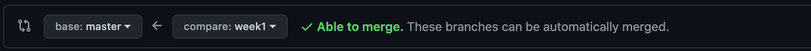
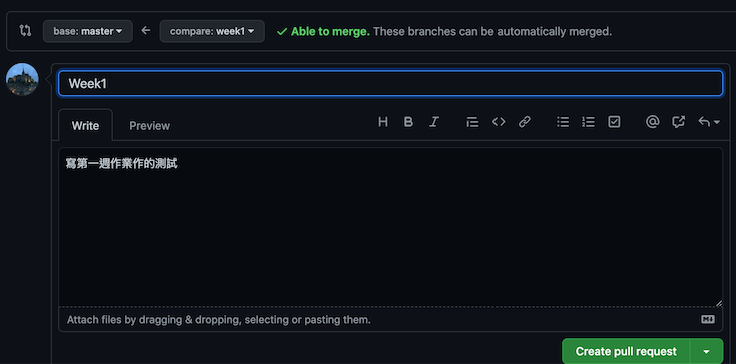
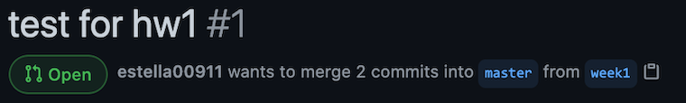

## 交作業流程
### 前置作業——下載專案
1. 加入 [Lidemy GitHub Classroom](https://classroom.github.com/a/yNNrtNyW) 後，會生成一個 [自己的 GitHub repository](https://github.com/Lidemy/mentor-program-5th-estella00911)，名稱為 `mentor-program-5th- GitHub 的帳號`  
2. 在 GitHub repository 上透過複製 repo URL 下載專案  
3. 把 GitHub 上的專案下載到自己電腦：  
(1) 打開 terminal ，移至欲下載的檔案位置：`cd document/github`  
(2) 下載專案至電腦：`git clone <repo URL>`  
### 寫作業
- 在電腦（local 端）上完成 week1 作業  
- 確認`自我檢討`  
### 交作業
#### 一、在 local 端的 git 上操作  
1. **建立新的分支（branch），名稱為 week1 ：`git branch week1`**  
2. **移至 week1 branch ：`git checkout week1`**  
　- 可以使用 `git branch -v` 確認當前位在哪個 branch  
　- `git branch -b week1` 同時建立新 branch ，也移動至該 branch。  
3. **查詢狀況 `git status`：**  
查詢當前目錄狀態為 `Changes not staged for commit`（等待提交），表示該檔案修改後，尚未被提交（commit）至暫存區（stage）。  
4. **加入版本控制 `git add <fileName>`：**  
`git add hw1.md` 將異動後的 hw1.md 檔案加入版本控制，但尚未正式建立新版本，所以還需要`git commit -m message`建立起新的版本。  
其中 `Changes to be committed` 表示已將異動的 hw1.md 加入暫存區（stage）。  
5. **建立新版本 `git commit -m 'commitMessage'`：**  
`git commit -m 'finish hw1'` 將最新的檔案建立起新的版本，其中 `-m 'finish hw1'`加入註解，讓自己可以辨識版本做了什麼，如 finish hw1。  
6. **將 local 端提交紀錄至遠端版本庫（repository）：`git push origin master`**  
其中 origin 為 repository 的簡稱，master 為其 repository 的分支。  
7. 確認電腦 local 端和repository 有無連接。  
查詢 `git remote -v` 可顯示遠端版本庫連結跟簡稱的內容。  
(1) 若使用 `git clone <URL>` 下載專案的話，會自動設定該遠端版本庫（repository）專案的網址。  
(2) 若是新建一個專案，local 端尚未連接 repository 的話，就要使用 `git remote add <name> <URL>`，其中 <URL> 為所需連接 repository的網址，<name>則為此 repository 的簡稱。  
8. 將在 local 端完成的作業（或專案） push 到 GitHub 的 repository上：`git push <repositoryName> <branch>`  

#### 二、在 GitHub 的 repository 上操作
1. 重新整理頁面：  
[Lidemy/mentor-program-5th-estella00911](https://github.com/Lidemy/mentor-program-5th-estella00911)
1. create pull request：  
(1) 點選 compare & pull request
 

   
(2) 選擇將 week1 合併至 master（如圖所示為：master ← week1）  

 
(3) 填寫好 title 和 content 後， create pull request 發通知給原作者。  

 
3. 在 GitHub 部分完成後，會呈現下圖  

 

#### 三、助教改好作業：  
在 GitHub 上，week1 branch 會被合併到 master 主幹裡面，所以 week1  branch 會被刪除。原作者（助教）合併表示收下協作者（我）的 request。  

#### 四、在 local 端刪除 week1 branch
在 branch 的內容，已經順利地合併到 master 了，在 repository 的 week1 branch 已被合併跟刪除，所以也要刪除 local 端的 week1 branch。
1. git 離開 week1 branch，使用`git checkout master`回到 master。
2. 從 GitHub repository 下載，更新 local 的檔案：`git pull origin master`
3. 刪除 local 端的 week1 branch：`git branch -d week1`

### 參考：
[與其它開發者的互動 - 使用 Pull Request（PR）](https://gitbook.tw/chapters/github/pull-request.html)