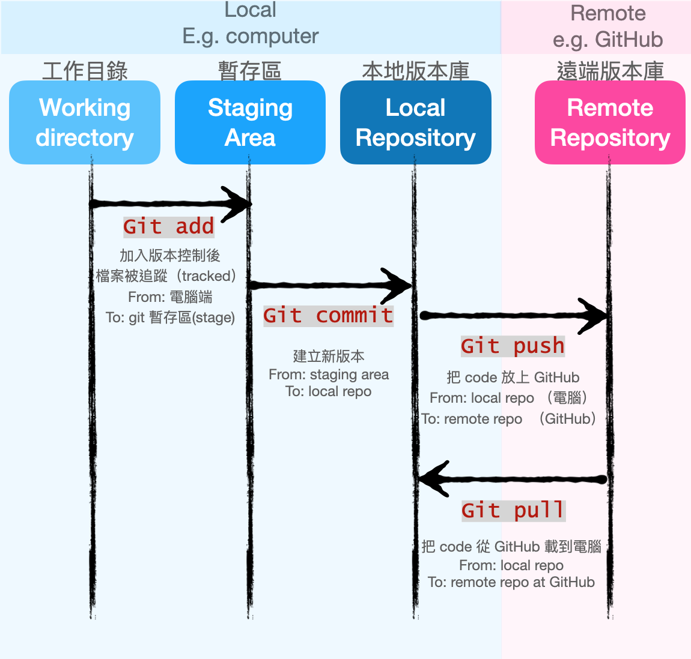

# hw4: 跟你朋友介紹 Git
## 零、作業說明
###### 因為你的人實在是太好，時不時就會有朋友跑來找你來幫忙。
###### 這次來的是一個叫做菜哥的朋友，會叫做菜哥是因為家裡賣菜，跟你認識的其他人同名的話純屬巧合。
###### 菜哥：「就是啊，我最近有一個煩惱。因為我的笑話太多了，所以我目前都用文字檔記錄在電腦裡，可是變得越來越多之後很難紀錄，而且我的笑話是會演進的。會有版本一、版本二甚至到版本十，這樣我就要建立好多個不同的檔案，弄得我頭很痛，聽說你們工程師都會用一種程式叫做 Git 來做版本控制，可以教我一下嗎？」
###### 『好吧，我試試看』
###### 菜哥：「謝啦，話說你來參加這個計畫學程式真的選對了欸，之後就不會有貧血的困擾了」
###### 『為什麼』
###### 「因為你會寫程式」
###### 『...』
###### 「喔...原來是血乘四的部分啊（拍手）」
###### 就是這樣，在一陣尬聊之中你答應了菜哥的要求，要教他怎麼使用 Git 來管理他的笑話。
###### 因此，你必須教他 Git 的基本概念以及基礎的使用，例如說 add 跟 commit，若是還有時間的話可以連 push 或是 pull 都講，菜哥能不能順利成為電視笑話冠軍，就靠你了！

## 一﹑Git 的基本概念
### 什麼是 git ？
Git 屬於「分散式版本控制系統」，顧名思義就是分散式的系統，在每個用戶端的檔案不只是最新的檔案版本，也會將遠端版本倉庫（repository）的檔案完整下載在電腦的 local 端（意即進行完整的映象檔）。這樣若遠端版本庫出現故障，每個用戶都可以使用自己的完整檔案，將故障的版本庫恢復。
### 為什麼需要 git ？
若是以使用電腦為主要工作的話，常常會需要修改檔案，就會有產生很多版本，如版本一修改錯誤、版本二新增功能等等。如果又碰到多人一起完成的檔案，如果同時修改，就可能會覆蓋到別人的檔案，又如果開發新功能失敗，造成檔案壞掉的話，就需要將檔案回復到原本的版本，也就是說需要再備份一份，如果在每個版本都備份一份的話，檔案數量就會增加，也會造成不易管理。所以為了更方便跟有條理的管理不同的版本，就發展出 git 來做版本控制。[1]
## 二、基礎的 Git 使用
###### 例如說 add 跟 commit，若是還有時間的話可以連 push 或是 pull 都講。
### git 怎麼做版本控制？
若是自己一個人做一份報告時，會根據修改的版本一、版本二、版本三做儲存，才不會搞混新舊。在電腦上實際操作的話，就像是資料夾 report 內有 code.js 和 text.txt 兩個檔案，平時修改很多次 code.js 或 text.txt，產生很多種版本在 report 資料夾內，如 code_1.js、 code_2.js、text.txt，因為 code.js 需要搭配著 text.txt 做閱讀，如果檔案內有很多版本的話，會不知道 code_1.js 要搭配的是 text_1.txt 還是 text_2.txt 做閱讀。所以將 report 資料夾複製成不同版本，如下：

- report (version 1) > code.js, text.txt
- report (version 2) > code.js, text.txt
- report (version 3) > code.js, text.txt

這樣就不會搞混哪一個版本的 code.js 要搭配哪一個版本的 text.txt 閱讀。

多人協作的話，會有更改內容、時間先後、主要次要內容的問題，例如：

- A: report(v1) > code.js, text.txt
- B: report(v2) > code.js, text.txt
- C: report(v5) > code.js, text.txt

這樣會搞不清楚哪一個是最新的版本，只能根據最後更改時間作依據。後來想到一種方法，就是為不同的版本命名亂數代號，並將更改的內容、建立版本的時間寫起來放在一個歷史紀錄中，便於查看，也可以利用亂數代號回到某個版本。
- `[fesfe04]` A: report(v1) > code.js, text.txt
- `[ffe123f]` B: report(v2) > code.js, text.txt
- `[cd12fe4]` C: report(v5) > code.js, text.txt

版本控制就很像每個資料夾都被賦予一個亂數代號，這樣也可以確保版本與版本之間的名字不會重疊。
### 
### 如何將檔案加入 git？
1. 將電腦內的資料夾加入 git 版本控制  
(1) 開啟 git （terminal 或 git bash）
(2) 利用 command line 指令—— `cd`，移動到電腦內想要加入版本控制的資料夾。其中 `ls`（列出檔案清單） 和 `pwd`（印出所在位置） 也可以輔助。
(3) 輸入 `git init`，會出現 `initialized empty Git repository in 路徑/test_git_demo/.git/` 這時候這個資料夾已經進入 git 的版本控制。  
2. 複製（clone）別人的 repository
(1)在 GitHub 上看到其他人的程式碼，或者是團隊中的專案，想下載下來修改的話，可以複製他的 repository URL。
(2) 在 git 上操作，移動目錄後，輸入 `git clone <repo URL>`，就把他人的程式複製下來到自己的電腦中。
```bash
git clone https://github.com/estella00911/Practic_0320.git
```

### 將檔案加入 git 版本控制
從別人的 repository 下載下來，或者是自己建立一個專案，已經完成了 git 的環境設置，但是這些檔案還沒有被加入 git 的版本來控制。因此，再來就是要將修改的內容寫入版本控制，這樣一來就可以有效的控制不同版本，可以知道哪個版本做了什麼修改，也可以作為歷史紀錄，以備未來需要。  

使用 `git add <file>` 可以讓電腦裡未被 git 追蹤的檔案，加入 git 的追蹤，放入暫存區（staging area），這樣一來，如果該檔案有被修改過，就會被 git 記錄下來，但是光使用`git add`僅僅是被 git 追蹤，還沒有正式被記錄在版本歷史之中，沒有辦法知道做了什麼更動。所以要被加入版本歷史，記錄更動，需要將檔案再使用 `git commit -m <message>`，將檔案建立一個新的版本，置放在電腦內的本地版本庫（local repository），其中 `<message>`為描述遞交的內容，這樣可以一目了然的知道在這一版本新增、更改了什麼內容。

那現在就有個問題，我怎麼知道此時檔案位在哪一個步驟？是被追蹤呢？還是被建立成一個新的版本？此時就需要查詢 git 的狀況——`git status`。此外，查詢版本的歷史紀錄，可以透過`git log`，來查看記錄。

1. `git status`：檢查 git 的狀況。
2. `git add`：將檔案加入版本控制。
3. `git commit`：建立一個新的版本。
4. `git log`：查看版本紀錄。

### git 操作流程 [2]


### 如何把建立的版本上傳到 GitHub，讓大家可以更精進菜哥的冷笑話？
前面提到如何建立新版本，將檔案變更留存在歷史記錄中，但不可能只放在自己的電腦內的 local repository，要做出成果，讓別人看到，此時就需要將 code 放上去網路平台，如 GitHub 上。那要怎麼上傳到遠端版本庫（remote repository），如 GitHub 呢？

要連結上一個遠端版本庫（remote repository），才可以將電腦內的檔案上傳到遠端去。所以要建立一個遠端版本庫，才可以將電腦檔案上傳到我的遠端版本庫，常用的遠端版本庫為 GitHub 的 repository。

首先，要在 GitHub 註冊，並建立一個 repository，假設將 repository 取名為 project1，複製（clone）repository 的 https URL（例如：https://github.com/estella00911/project1.git）

此時回到 command line，把電腦的本地版本庫連結上 GitHhub 的遠端版本庫（remote repository），輸入 `git remote add <remote repo 簡稱> <repo URL>`，其中`<remote repo 簡稱>`賦予遠端版本庫的簡稱，這樣在使用`git push <remote repo 簡稱> master` 上傳本地版本庫的檔案時，可以以`<簡稱>`代替遠端版本庫的網址，如此一來就順利將菜哥的冷笑話上傳到網路上，可以讓大家看到菜哥的成果作品。

push 的相對是 pull，在 git 中，push 是將本地版本庫的檔案上傳到遠端版本庫，而 pull 就是從遠端版本庫下載檔案到本地版本庫。當遠端版本庫的檔案有做版本更新，此時版本與本地版本庫舊的版本不同，就需要將新的檔案從遠端版本庫抓下來更新到本地版本庫。

## 三、參考：
[1] 《Github創辦人親自指導你精通Git》 Chacon Scott, Straub Ben著  

[2][「Git」基本觀念與操作](https://www.google.com/url?sa=i&url=https%3A%2F%2Fmedium.com%2F%40lionel_0814%2Fgit-%25E5%259F%25BA%25E6%259C%25AC%25E8%25A7%2580%25E5%25BF%25B5%25E8%2588%2587%25E6%2593%258D%25E4%25BD%259C-32f5dd0913e3&psig=AOvVaw01_QBj3qQRVbKg7BF3Uhpg&ust=1618838902987000&source=images&cd=vfe&ved=0CAIQjRxqFwoTCIDdu4Hzh_ACFQAAAAAdAAAAABAP)