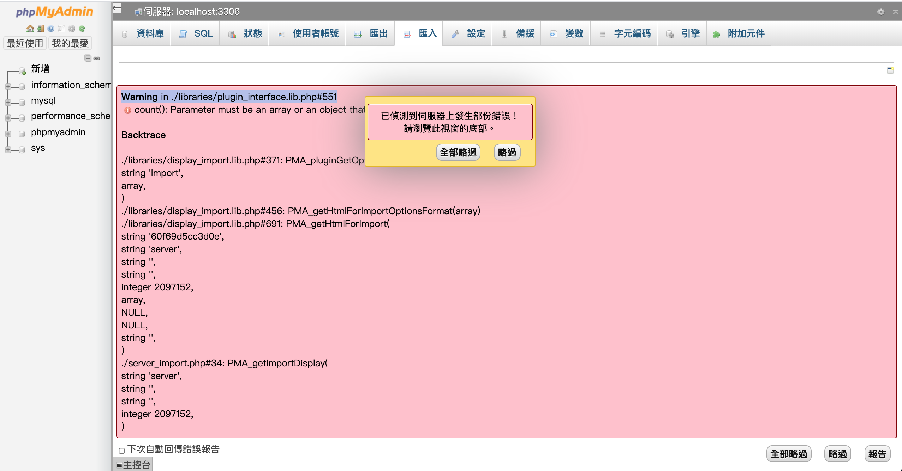

# hw2 部署心得
將部署 AWS EC2 紀錄寫在[這篇文章](https://www.coderbridge.com/@estella00911/819594c46c43443db4bbe8046f2b2e1b)裡。

## 整體部署心得
### 部署過程
因為這個防火牆的問題，前前後後因為不知道怎麼 debug，就前前後後重新架了 AWS EC2 server 七八次快十次了，因為我四處參考教學文章，最後弄的很複雜，東一塊西一塊的，最後部署成功是乖乖參考[這篇(https://github.com/Lidemy/mentor-program-2nd-yuchun33/issues/15)，沒有做其他額外的 ubuntu 設定。

一開始挺摸不著頭緒的，在[鳥哥私房菜](http://linux.vbird.org/linux_server/0360apache.php)裡看了很多關於 LAMP、Apache 還有一些網路知識，裡面的文字深入淺出，很白話。

過程中遇到滿多 ubuntu 上的執行錯誤，就開始 google 查詢問題所在，其實都滿零碎的，有時候想要解決錯誤到已經迷失了方向，不知道現在做到哪了，所以只好暴力砍掉重新架設 AWC EC2 server。

### gandi 
後來在有了 gandi 網域後，本來有嘗試要轉址，將原本的 `http://estella00911.tw` 轉成 `https://www.estella00911.tw` 之類的網址，但好像轉址發生錯誤，無法進入該網站，還有下面這張圖，或者是 `Not Found`，不可開啟該網頁等等的問題發生。


這個網站也是在 google 的 SEO 很強大，怎麼搜，都會搜到官網的常見問題連結，後來是更改 `gandi > 域名 > 自己的網域 > 區域檔紀錄` 裡的紀錄。
>// 區域檔紀錄的 default
~~@ 10800 IN A 217.70.184.38~~
`@ 10800 IN A <自己的IPv 4 IP>`
@ 10800 IN MX 10 spool.mail.gandi.net.
@ 10800 IN MX 50 fb.mail.gandi.net.
@ 10800 IN TXT "v=spf1 include:_mailcust.gandi.net ?all"
_imap._tcp 10800 IN SRV 0 0 0   .
_imaps._tcp 10800 IN SRV 0 1 993 mail.gandi.net.
_pop3._tcp 10800 IN SRV 0 0 0   .
_pop3s._tcp 10800 IN SRV 10 1 995 mail.gandi.net.
_submission._tcp 10800 IN SRV 0 1 465 mail.gandi.net.
gm1._domainkey 10800 IN CNAME gm1.gandimail.net.
gm2._domainkey 10800 IN CNAME gm2.gandimail.net.
gm3._domainkey 10800 IN CNAME gm3.gandimail.net.
webmail 10800 IN CNAME webmail.gandi.net.
~~www 10800 IN CNAME webredir.vip.gandi.net.~~

> 
設定好區域檔紀錄後，需要等待一段時間讓 gandi 連結好，這時可以使用 [whatsmydns](https://www.whatsmydns.net/) 來看有沒有成功。

## 遇到的錯誤紀錄
### 防火牆設定
#### 問題：SSH 登入連線逾時
先前參考[一小時完成 VPS (Virtual Private Server) 部署](https://github.com/Lidemy/mentor-program-2nd-futianshen/issues/21)
 的第五步驟開啟防火牆之後要再次登入時，會連線逾時所發生的問題。

後來找到[[教學] UFW 防火牆設定軟體操作指南](https://xenby.com/b/258-%E6%95%99%E5%AD%B8-ufw-%E9%98%B2%E7%81%AB%E7%89%86%E8%A8%AD%E5%AE%9A%E8%BB%9F%E9%AB%94%E6%93%8D%E4%BD%9C%E6%8C%87%E5%8D%97) 可以在 ubuntu 伺服器上查詢防火牆是否有啟用，以及設定 port 的開啟，設定開啟
```bash
$ sudo ufw status verbose
> Status: inactive
$ sudo ufw allow 22
$ sudo ufw enable
$ sudo ufw status verbose
# 就可以看到允許 port 22 存取了
```

### phpMyAdmin 遇到的問題
#### 問題一：下載 phpmyadmin
下載 phpmyadmin 時，有個步驟是 「Configuring phpmyadmin」，需要**按空白鍵**，選擇「連接 apache 2」，先前安裝後，都沒有「按空白鍵」設定 web server toreconfigure automatically。

#### 問題二
1. 狀況描述：要匯入 phpMyAdmin 資料表時，發生匯入錯誤。




2. 預期結果：成功匯入
3. 錯誤提示：`Warning in ./libraries/plugin_interface.lib.php#551`
4. 資料查詢：
> php 7.2 後，count() 沒有添加參數的情形下，就會噴出Warning，而對於這個問題 phpMyAdmin 還沒有排除此錯誤，所以必須靠我們自己手動解決。
> [From: Day 03 : 環境架設 part II -- MySQL & phpMyAdmin](https://ithelp.ithome.com.tw/articles/10216815?sc=rss.iron)
5. 解決 #551 錯誤
    - 進入 ubuntu 主機，輸入以下指令：
```
$ sudo vim /usr/share/phpmyadmin/libraries/plugin_interface.lib.php
```
    - 修改檔案：
將第 551 行的 `count($options) > 0` 去掉
```php
// 原本 code @ 551 line
if ($options !=null && count($options) > 0) {
// 修改成：
if ($options != null ) {
    // ...
}
```

#### 問題三
資料表匯入發生錯誤
1. 狀況描述：要匯入 phpMyAdmin 資料表時，發生匯入錯誤。


1. 預期結果：成功匯入資料表
2. 錯誤提示：`＃1046 - No database selected`

3. 解決 ＃1046 錯誤
    - 發現是沒有建立資料表 data_name（資料庫） 所以他不知道要匯入到哪個 data_name（資料庫），後來我在左方欄建立了一個 data_input 資料庫。
    
    - 在 data_input 的資料庫，按「匯入」，將準備好的 .sql 檔案上傳上去。
    
    - 等檔案上傳完畢後，按最下方的執行，就成功匯入資料表了！
    

