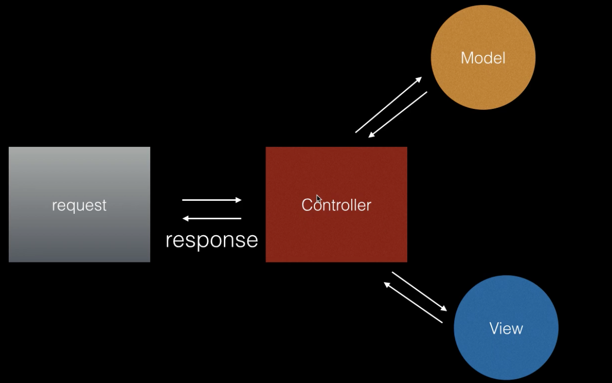

## 什麼是 MVC？

## MVC 
MVC 為 Model, View, Controller 的縮寫
中間怎麼互通： request, controller, view, model 怎麼溝通，根據不同模式有不同溝通方式。
- Controller：負責管理其他東西，controller 就是 model 與 view 中間的協調者。
- Model：負責管理資料
- View： template 模版，負責管理顯示相關

## 步驟：
1. request → Controller：request 進入 MVC 後，會交由 Controller 處理。
2. Controller → Model：之後 Controller 會負責和 Model 拿資料。
3. Model → Controller：Model 將 data 交給 Controller，function 裡面就會有從 model 拿回來的 data。
4. Controller → View：Controller 呼叫 view，將 data 塞入模版（template, view）。
5. View → Controller：view 就有一完整的 response 出來。
6. Controller → request： Controller 再將完整的 response 回傳回去。

## 請寫下這週部署的心得
在此放上[部署過程紀錄](https://www.coderbridge.com/@estella00911/d9062ac8990a4200a2fe53138a843fde)

其實一開始，我是看了網路上很多其他人寫的部署心得，自己還是卡住，我覺得大多只有寫出最主要的步驟，但是操作的中間過程還有很多可能會出錯誤的步驟，就會卡住，或者是搞不清楚改到哪。

後來打開 `Heroku` 的官網教學指南，一開始就是跟著做，然後一樣搞不太清楚是要跟著 [`getting started`](https://devcenter.heroku.com/articles/getting-started-with-nodejs)，還是要跟著 [`node.js` 的教學指南部署](https://devcenter.heroku.com/articles/nodejs-support)，就兩個交疊著看，以 `getting started` 帶著我從 clone `Heroku` 自己的專案資料夾先在 local 嘗試，然後再修改本地端檔案 push 至 Heroku 過程順皆利後，再放進自己的專案資料，過程中我在 `coderBridge` 上邊紀錄自己打了什麼指令和修改了什麼檔案，因為我如果寫在筆電備忘錄，最後的下場就是忘記搬移，然後就放到長灰塵，但是如果我寫在 coderBridge 的文章草稿中，就會想到我既然都紀錄了，自己就會有想要把他寫成一篇文章發布的衝動！），然後一步步嘗試，做到最後的連結資料庫，就跟著 `[BE201]` 一起做。

過程中遇到滿多的錯誤訊息提示，從完全看不懂 `logs` 在顯示什麼，試著跟 `[BE201]` 部署影片上的 `heroku logs -t` 上顯示的修改到顯示的內容相似。

以下是遇到的一些錯誤訊息：
1. **`body-parser`**：
```bash
app[web.1]: Mon, 06 Sep 2021 03:37:00 GMT body-parser deprecated undefined extended: provide extended option at index.js:23:20
```
後來是查到 `./index.js` 中的這行，要加上 `{ extended: true }`

```javascript
- app.use(express.urlencoded())
+ app.use(express.urlencoded({ extended: true }))
```

--- 

2. **`express-session`**：

```bash
app[web.1]: Mon, 06 Sep 2021 03:37:00 GMT express-session deprecated req.secret; provide secret option at index.js:25:9
```

把 `secret` 的內容從環境變數，改為先設一個變數，然後放入環境變數，再套到 `session({})` 內。
另外還加了 if 條件式，怕沒有在環境變數設定 `SESSION_SECRET` 的話，會自動建立一個。這個部分是從 `Heroku` [環境變數的 port 設定](https://help.heroku.com/P1AVPANS/why-is-my-node-js-app-crashing-with-an-r10-error) 上學來的。

```javascript
+ let SESSION_SECRET = process.env.SESSION_SECRET
+ if (SESSION_SECRET == null || SESSION_SECRET == "") {
+   SESSION_SECRET = 'keyboard cat'
+ }
  app.use(session({
+   secret: SESSION_SECRET,
-   secret: process.env.SESSION_SECRET,
+   resave: true,  // original false
-   resave: flase,
    saveUninitialized: true,
    cookie: { maxAge: 60000 }
  }))
```

---

3. **`SequelizeConnectionRefusedError`**

```bash
app[web.1]: (node:22) UnhandledPromiseRejectionWarning: SequelizeConnectionRefusedError: connect ECONNREFUSED 127.0.0.1:3306
app[web.1]: at ConnectionManager.connect (/app/node_modules/sequelize/lib/dialects/mysql/connection-manager.js:116:17)
```
這個就是需要在 Heroku 建立一個資料庫，後來使用 `Heroku add.on` 的 `clearDB`。

---

4. **`SequelizeDatabaseError: Table 'heroku_fec0741d0bf13df.prizes' doesn't exist`**

```bash
app[web.1]: (node:22) UnhandledPromiseRejectionWarning: SequelizeDatabaseError: Table 'heroku_fec0741d0bf13df.prizes' doesn't exist
app[web.1]: at Query.formatError (/app/node_modules/sequelize/lib/dialects/mysql/query.js:265:16)
```

這個就是找不到 database 的 Table 所以後來在每次 run 時，執行 `npx sequelize db:migrate` 建立 table。

---

## 寫 Node.js 的後端跟之前寫 PHP 差滿多的，有什麼心得嗎？

### Node.js 的後端
有一點 PHP 的感覺，不過跟 PHP 相比，把功能分開來實作，在日後的理解跟修改上也方便很多，只要去專注於某一部分的 code 就好，不過一開始在接觸 `MVC` 時，腦袋一直卡住，想不通為什麼可以從路由 `index.js` 製作路徑，什麼時候要用 `post`，什麼時候要用 `get`，然後再在 `models` 放資料，在 `views` 處理渲染靜態頁面，在 `controllers` 將資料與靜態頁面連結在一起，那這樣要怎麼把後端資料傳到前端的頁面？真的是要實作後，從頭開始想一遍，然後我甚至還拿活頁紙寫下了每天的思考紀錄，這樣才能在晚上寫進度報告時，再回想一次是卡在哪，有哪些地方想不通，或者是怎麼想到解決方法。
想通之後，日後有什麼小地方像是登入、註冊、編輯文章、刪除文章要修改的話，只要找到相關的 `models`、`controller`、`views` 修改就可以了，方便許多，不像是 PHP 還要確認每個頁面可能會用到登入功能，那可能有使用到的頁面都要修改。

### PHP
PHP 比較直覺一點，就是可以穿插在 HTML 之間，不用思考這個應該放在哪個架構裡面的哪個資料夾才對，不過也穿插在 HTML 之間，也造成 code 解讀上的困難，有時候看一看 HTML code，會看到 PHP 的語法。另外還要熟習 SQL 語法，防範 SQL injection 攻擊。